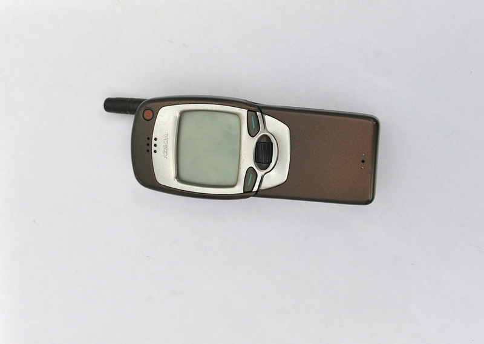

# Qwen2-VL on TextVQA (QLoRA)

This repo adapts **Qwen2-VL-2B-Instruct** to **TextVQA**—reading text in images and answering short questions about it. We fine-tune with **QLoRA** (4-bit base model + small LoRA adapters on the language model; vision stays frozen), then compare the **base checkpoint** and the **adapter** on the same held-out questions so gains are apples-to-apples.

### Example data point (TextVQA)

One row from the **train** split ([`textvqa` on Hugging Face](https://huggingface.co/datasets/textvqa)): a photo plus a question whose answer is grounded in on-image text.



| | |
|--|--|
| **Question** | what is the brand of phone? |
| **Reference answers** (annotators; subset) | nokia, nokia, nokia, … |

---

## Results

Evaluation uses a **non-overlapping** slice of the TextVQA validation split (no overlap with the subset used for Trainer validation during training). Metrics compare string predictions to reference answers (exact / relaxed / VQA-style / substring).

| Metric | Baseline | Fine-tuned | Δ |
|--------|----------|------------|---|
| Exact match | 23.80% | 29.40% | +5.60 pp |
| Relaxed match | 55.60% | 56.00% | +0.40 pp |
| VQA accuracy | 73.40% | 73.67% | +0.27 pp |
| Substring hit | 79.80% | 79.80% | 0.00 pp |

*Example run: short-answer instruction suffix, 5k training samples; retrain after changing data size or hyperparameters and refresh this table if you report numbers publicly.*

---

## Setup

- **GPU** with enough VRAM for 4-bit Qwen2-VL at your batch settings (defaults target roughly **~11 GB**; reduce image pixel bounds or batch size if needed).
- **Python** 3.9+ (newer Python makes it easier to install recent `bitsandbytes` wheels).

```bash
pip install "torch" --index-url https://download.pytorch.org/whl/cu118   # match your CUDA
pip install "transformers>=4.45.0" accelerate peft datasets tqdm pillow bitsandbytes qwen-vl-utils
```

Hugging Face Hub access for **TextVQA** and **Qwen2-VL** weights (`huggingface-cli login` if a model is gated).

---

## Train

```bash
python train.py
# Multi-GPU:
torchrun --nproc_per_node=2 train.py
```

Training pulls TextVQA from the Hub, formats chats with image + question, and optimizes only the assistant answer tokens. Checkpoints, the LoRA adapter, processor, and `run_meta.json` land under `./qwen2vl_textvqa_qlora` by default. Key settings (model id, **`train_samples` / `val_samples`**, LoRA rank, epochs, LR, batching) live in the `Cfg` dataclass in `train.py`.

---

## Evaluate

```bash
python evaluate.py --adapter_path ./qwen2vl_textvqa_qlora --num_samples 500 --batch_size 4 --results_path ./eval_results.json
```

`run_meta.json` keeps validation shuffle and slice sizes aligned with training so the holdout set stays disjoint from Trainer eval.

---

## Outputs

| Path | Role |
|------|------|
| `output_dir/` | Adapter, processor, Trainer checkpoints |
| `output_dir/run_meta.json` | Seeds and sample counts for reproducible eval |
| `eval_results.json` | Baseline vs fine-tuned metrics and sample predictions |

---

## Troubleshooting

- **OOM** — Lower batch size, raise gradient accumulation, or reduce `max_pixels` in `train.py` where the processor is built.
- **Multi-GPU** — Prefer `torchrun` or a single visible GPU; see comments in `train.py` if you hit 4-bit + DataParallel issues on older stacks.
